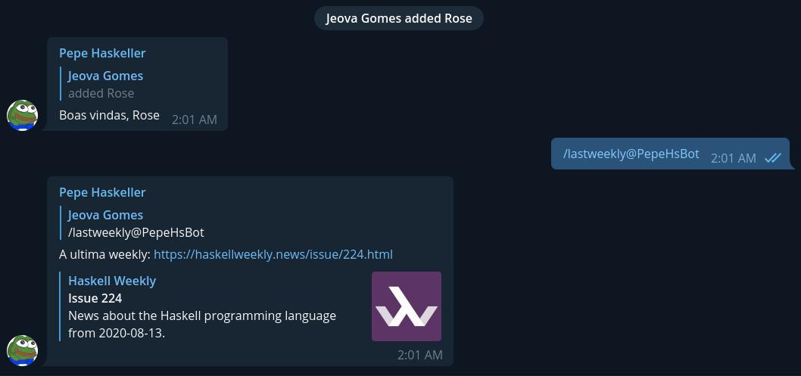

## Pepe Haskeller Bot

A small Telegram bot project made in Haskell

<div align="center">
    
    
</div>

### Features:

⭐ Welcome message for new chat members (Need a better message)

⭐ `/lastweekly` command to get the link of the last haskell weekly

⭐ Send a haskell code and receive a beautiful image of it.

### Scripts

Requirements:
- Nix
- put your bot token in the **BOT_TOKEN** environment variable

#### Build
```sh
$ make build
$ ./result/bin/bot-poc
```

#### Code Reloading
```sh
$ make dev
```

by jeovazero
