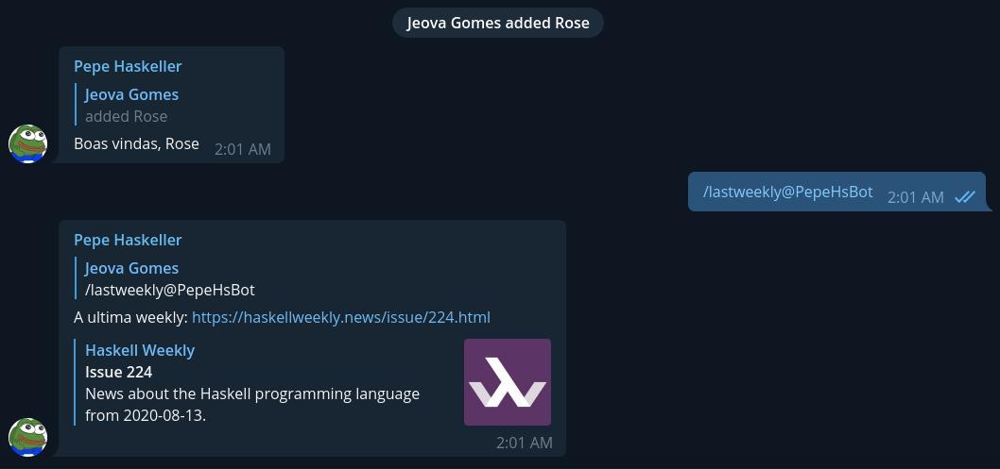

## Pepe Haskeller Bot

A small Telegram bot project made in Haskell

<div align="center">
    
</div>

### Features implemented:

⭐ Welcome message for new chat members (Need a better message)

⭐ `/lastweekly` command to get the link of the last haskell weekly

### Scripts

#### Build
```sh
$ make build
$ ./result/bin/bot-poc
```

> put your bot token in the **BOT_TOKEN** environment variable

#### Code Reload
```sh
$ make dev
```

by jeovazero
