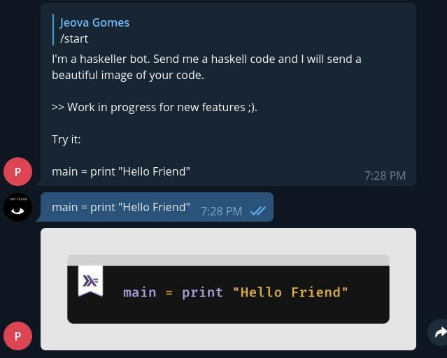

## Pepe Haskeller Bot

A small Telegram bot project made in Haskell

<div align="center">
    
</div>

### Features:

⭐ `/lastweekly` command to get the link of the last haskell weekly

⭐ Send a haskell code and receive a beautiful image of it. (using [caani](https://github.com/jeovazero/caani) to generate the images)

### Scripts

Requirements:
- Nix
- put your bot token in the **BOT_TOKEN** environment variable

#### Build
```sh
$ make build
$ ./result/bin/bot-poc
```

#### Code Reloading
```sh
$ make dev
```

### Running with Docker

##### From DockerHub

```sh
$ export BOT_TOKEN=YOUR_PRIVATE_TOKEN_HERE
$ docker run -it -e BOT_TOKEN=$BOT_TOKEN jeovazero/pepe-haskeller:latest
```

##### Local
1. Building
    ```sh
    $ make docker-image
    ```

2. Loading the image
    ```sh
    $ docker load < image
    90d0e0e046c1: Loading layer [==================================================>]  50.37MB/50.37MB
    Loaded image: jeovazero/pepe-haskeller:919bm53vklgwh57ddi529v546929jxkz
    ```

3. Running
    ```sh
    $ export BOT_TOKEN=YOUR_PRIVATE_TOKEN_HERE
    $ docker run -it -e BOT_TOKEN=$BOT_TOKEN jeovazero/pepe-haskeller:919bm53vklgwh57ddi529v546929jxkz
    ```


by jeovazero
